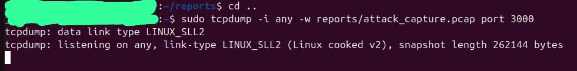
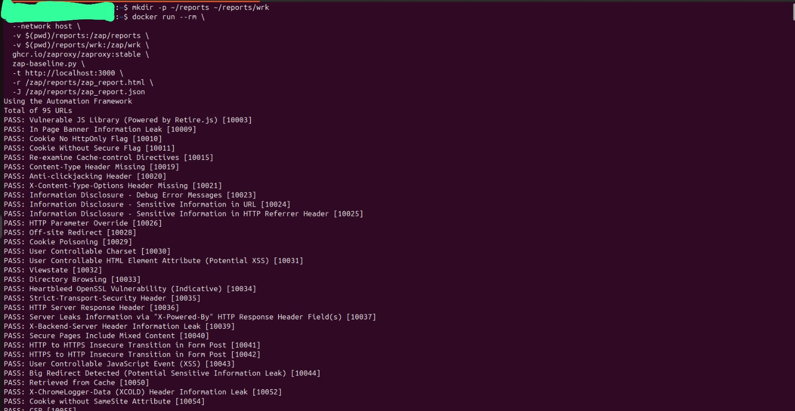
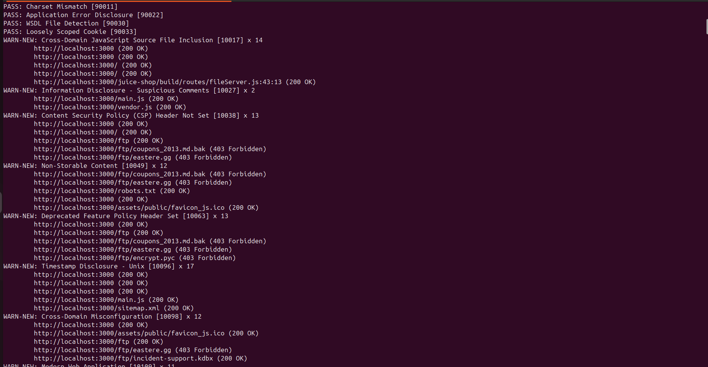
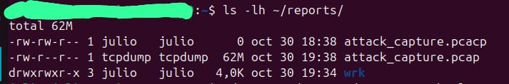
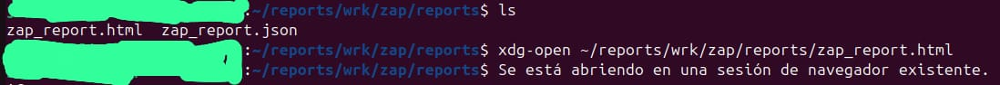
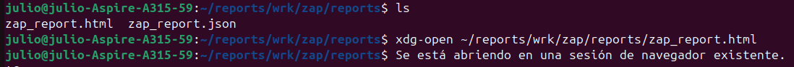
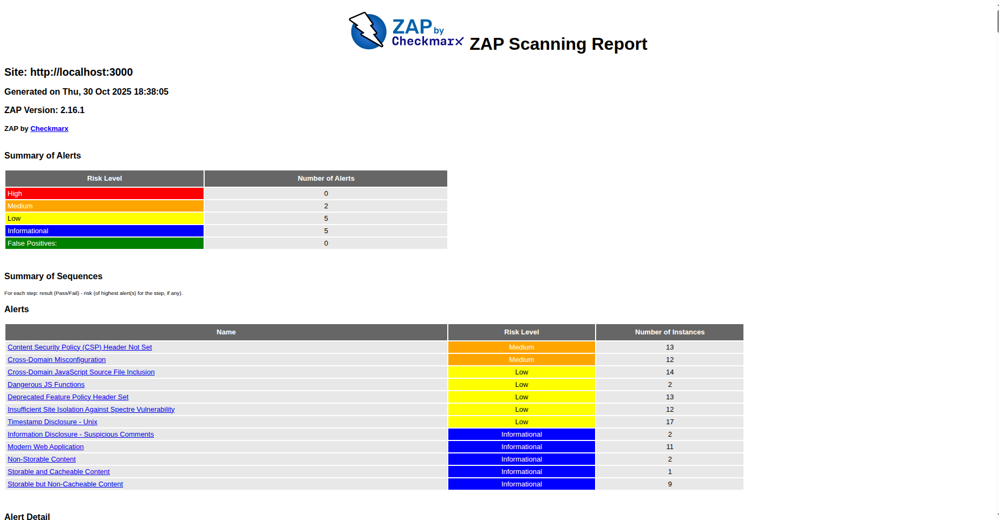
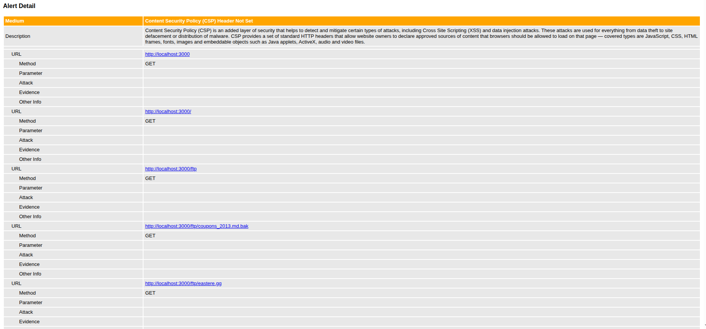
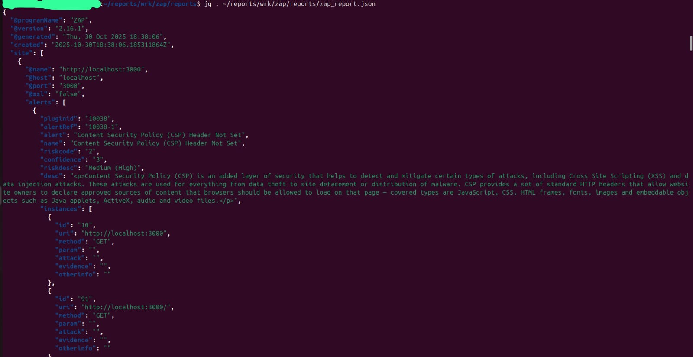

# Escenario A — XSS reflexivo (evidencias)

**Objetivo:** Detectar y documentar un XSS reflexivo en OWASP Juice Shop usando OWASP ZAP (DAST) y evidencias forenses (logs y pcap).

## Resumen breve
- Se ejecutó OWASP ZAP (baseline/active scan) contra Juice Shop (http://localhost:3000).
- Se generaron reportes `zap_report.html` y `zap_report.json`.
- Se capturaron evidencias: logs y (opcional) pcap.
- Carpeta: `reports/escenario-A_xss/`

## Evidencias (capturas)


**Leyenda:** Punto de escucha y contexto del entorno (puertos/containers).


**Leyenda:** Ejecución del job DAST en GitHub Actions (si fue ejecutado en CI).


**Leyenda:** Vista del árbol de URLs de ZAP o spider.


**Leyenda:** Detalle de una alerta (posible XSS), con evidence y endpoint.


**Leyenda:** Fragmento de logs del contenedor Juice Shop con la petición sospechosa.


**Leyenda:** Paquete HTTP que contiene la petición maliciosa (evidence).


**Leyenda:** Resumen del reporte ZAP (High / Medium / Low counts).


**Leyenda:** Fragmento del `zap_report.json` con evidence y url.


**Leyenda:** Otra vista del JSON para análisis automatizado.

## Archivos incluidos
- `zap_report.html`, `zap_report.json` — reportes ZAP.
- `images/*` — capturas numeradas.
- `attack_capture.zip` — pcap comprimido (si incluido).
- `juice_logs.txt` — logs del contenedor (si añadido).

## Reproducción (comandos seguros)
```bash
# Levantar Juice Shop
docker run -d --name juice-shop -p 3000:3000 bkimminich/juice-shop

# Ejecutar ZAP baseline (Linux)
docker run --rm --network host -v $(pwd)/reports/escenario-A_xss:/zap/reports ghcr.io/zaproxy/zaproxy:stable zap-baseline.py -t http://localhost:3000 -r /zap/reports/zap_report.html -J /zap/reports/zap_report.json

# Guardar logs
docker logs juice-shop > reports/escenario-A_xss/juice_logs.txt

# Capturar tráfico (opcional, en otra terminal)
sudo tcpdump -i any -w reports/escenario-A_xss/attack_capture.pcap port 3000
# Cuando termines, comprimir:
zip reports/escenario-A_xss/attack_capture.zip reports/escenario-A_xss/attack_capture.pcap
Mitigaciones recomendadas (resumen)
Escapar/encodear salidas HTML.

Implementar Content-Security-Policy (CSP).

Añadir validación y sanitización en backend.
